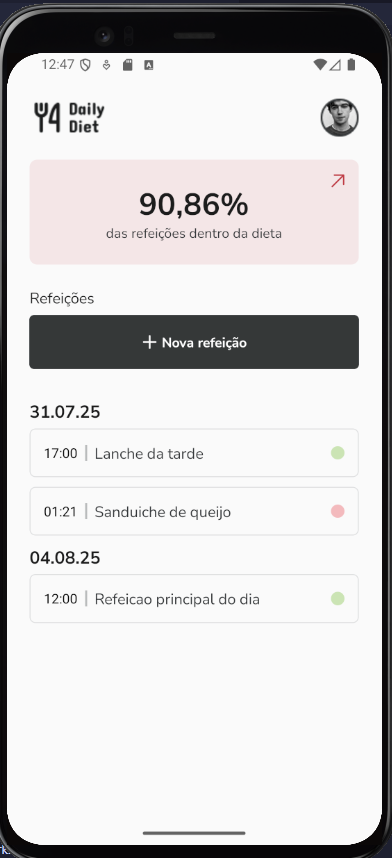

# 🥗 Daily Diet

**Daily Diet** is a simple and elegant mobile app built with **React Native**, **TypeScript**, and **Styled Components** that helps users track their daily meals and maintain healthy eating habits. Whether you're on or off your diet plan, Daily Diet helps you stay accountable and track your progress.

<p align="center">
  
</p>

---

## 📱 Features

- **Homepage**
  - Header with date and title
  - General overview card displaying your diet adherence
  - Quick access to meal creation
  - Meals list grouped by date
  - Navigate to individual meal details with edit/delete options

- **Statistics**
  - Summary dashboard with key metrics
  - Tracks number of meals on/off diet
  - Displays longest sequence of meals on diet
  - Shows overall percentage of meals on diet

- **Meal Management**
  - Create a new meal with details: name, description, date, time, and status (on/off diet)
  - Edit existing meals using the same form
  - Delete meals from your list
  - Visual feedback pages for success or failure based on meal status

- **Persistent Storage**
  - All data is stored locally using **AsyncStorage**
  - Full support for:
    - Creating meals
    - Listing all meals
    - Viewing meal details
    - Editing meals
    - Deleting meals
    - (Planned) Calculating diet adherence percentages

---

## 🧰 Tech Stack

- [React Native](https://reactnative.dev/)
- [TypeScript](https://www.typescriptlang.org/)
- [Styled Components](https://styled-components.com/)
- [AsyncStorage](https://react-native-async-storage.github.io/async-storage/)

---

## 🚀 Getting Started

### Prerequisites

- Node.js
- Expo CLI or React Native CLI
- Yarn or PNPM

### Installation

```bash
git clone https://github.com/your-username/daily-diet.git
cd daily-diet
pnpm install
